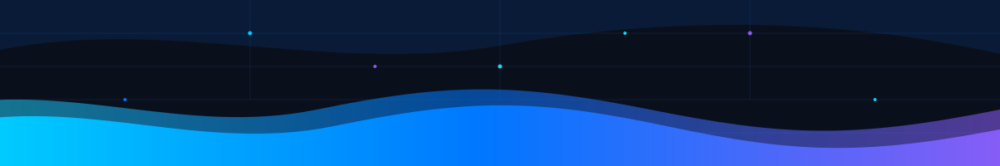
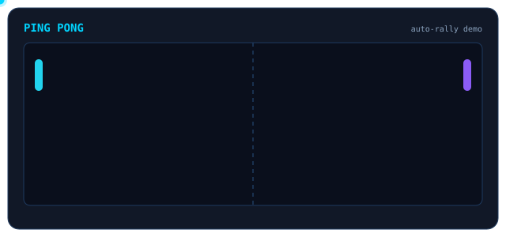

<div align="center">
  
</div>

<div align="center">
  
</div>

<div align="center">

  

  <br/>

  

  <br/>

  [](https://github.com/Saxena-Ashu)
  [](https://www.linkedin.com/in/saxenaashu)
  [](mailto:ashusaxena4767@gmail.com)
  [](tel:+918439364075)
  [](https://wa.me/918439364075)

</div>

<br/>

<p align="center">
  
</p>

<br/>

<div align="center">
  
</div>

## About

Full-Stack Software Engineer who architects and ships products end-to-end — from system design and API architecture to performance optimization and team leadership.

- **Location:** Bareilly, UP, India
- **Email:** ashusaxena4767@gmail.com
- **Phone:** +91 8439364075
- **GitHub:** [github.com/Saxena-Ashu](https://github.com/Saxena-Ashu)
- **Open to:** Senior Full-Stack / SDE roles

---

## Tech Stack

<div align="center">

### Languages


### Frameworks / Libraries


### Databases


### DevOps & Tools


### Core Competencies



</div>

---

## Technologies

<div align="center">
  
  <br/>
  <sub><i>React · Node.js · Express.js · Flutter · MongoDB · Docker · PostgreSQL · TypeScript</i></sub>
</div>

---

## Experience

<details>
<summary><b>Software Development Engineer — Helical Consulting</b> &nbsp;|&nbsp; <code>July 2026 – Present · Remote</code></summary>

<br/>

- **Architected and delivered** full-stack web applications at scale (React.js, Node.js, Flutter)
- **Designed and implemented** RESTful APIs — reduced response times through query optimization and caching
- **Owned frontend performance** — code splitting, lazy loading, and image optimization to hold 95+ Lighthouse scores
- **Led a cross-functional team** delivering mobile-first solutions, lifting user engagement by 30%

</details>

<details>
<summary><b>Software Engineering Intern — Larsen & Toubro</b> &nbsp;|&nbsp; <code>Jul 2025 – Sep 2025 · Faridabad</code></summary>

<br/>

- **Built PreBid Tracker** serving 200+ internal users — reduced bid processing time by 50%
- **Automated 15+ workflow processes** with Power Automate, saving 20+ hours weekly
- **Created PowerBI dashboards** delivering real-time analytics to 50+ stakeholders
- **Engineered Worker Monitoring System** (YOLOv8 + MediaPipe) with 92% activity recognition accuracy

</details>

---

## Projects

### TECHVOYM — Technical Fest Registration Portal

```
Stack: Node.js • Express.js • MongoDB • HTML5 • CSS3 • JavaScript • Docker
```

> End-to-end registration platform architected for peak traffic — 800+ concurrent users sustained at 99.9% uptime.

| Metric | Detail |
|---|---|
| Scale | **800+** concurrent users with **99.9% uptime** during peak traffic |
| Backend | Node.js + MongoDB → **500+** individual & **300+** team registrations |
| Reliability | Real-time validation & error handling → **60% fewer** registration failures |
| Monitoring | Computerized monitoring + alert system → **100% data integrity** over 72-hour window |

<div align="center">

<sub><i>platform scale — bars grow on load</i></sub>



</div>

---

## Key Metrics

<div align="center">

<sub><i>key outcomes, quantified — gauges fill on load</i></sub>



</div>

---

## Education

### SRMS College of Engineering Technology & Research

**B.Tech in Computer Science & Engineering** — CGPA: `7.29/10` | *Expected May 2026* | Bareilly, UP, India

- **Coursework:** Data Structures & Algorithms · Operating Systems · DBMS · Computer Networks · Software Engineering
- **Smart India Hackathon 2025** — Participant
- **United Group of Institutions Hackathon 2024** — 2nd Place

<br/>

<div align="center">
  
</div>

---

## Engineering Principles

- **Scale-first design** — systems built for scale from day one
- **Measure everything** — 95+ Lighthouse, 99.9% uptime, measurable wins
- **Ship iteratively** — real-time validation cut registration failures by 60%
- **Lead by building** — cross-functional teams, mobile-first delivery, engagement +30%

<div align="center">
  
</div>

---

## GitHub Stats

<div align="center">


<br/>


<!-- The github-readme-stats cards were removed while that service is down (HTTP 503). Restore them here once it recovers. -->

</div>

---

## Contribution Activity

<!--
  The snake below renders instantly from snake.svg (upload that file to the
  repo root). It becomes auto-updating if you also run the workflow once:
  Actions → "Generate Snake" → Run workflow → creates the "output" branch.
-->

<div align="center">
  <picture>
    <source media="(prefers-color-scheme: dark)" srcset="https://raw.githubusercontent.com/Saxena-Ashu/Saxena-Ashu/output/github-contribution-grid-snake-dark.svg" />
    <source media="(prefers-color-scheme: light)" srcset="https://raw.githubusercontent.com/Saxena-Ashu/Saxena-Ashu/output/github-contribution-grid-snake.svg" />
    
  </picture>
</div>

---

## Ping Pong

<div align="center">



<sub><i>auto-rally — no input needed</i></sub>

</div>

---

<div align="center">
  
</div>

<div align="center">


<br/>


</div>
