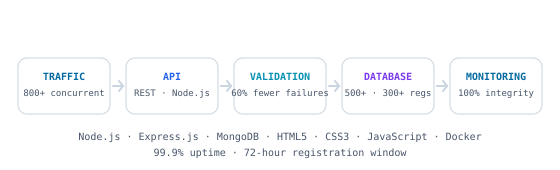
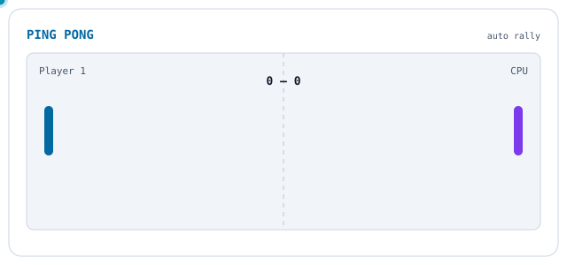

<div align="center">
  
</div>

<!-- ================= HERO ================= -->

<div align="center">
  <picture>
    <source media="(prefers-color-scheme: dark)" srcset="./assets/title-dark.svg" />
    <source media="(prefers-color-scheme: light)" srcset="./assets/title-light.svg" />
    
  </picture>
</div>

<div align="center">

  

  <br/>

  [](https://github.com/Saxena-Ashu)
  [](https://www.linkedin.com/in/saxenaashu)
  [](mailto:ashusaxena4767@gmail.com)
  [](https://wa.me/918439364075)

  <br/>

  <picture>
    <source media="(prefers-color-scheme: dark)" srcset="./assets/open-to-work-dark.svg" />
    <source media="(prefers-color-scheme: light)" srcset="./assets/open-to-work-light.svg" />
    
  </picture>

</div>

<br/>

<div align="center">
  <picture>
    <source media="(prefers-color-scheme: dark)" srcset="./assets/divider-dark.svg" />
    <source media="(prefers-color-scheme: light)" srcset="./assets/divider-light.svg" />
    
  </picture>
</div>

<!-- ================= ABOUT ================= -->

## About

<div align="center">

Software Development Engineer building full-stack applications end-to-end — REST API design, system architecture, performance optimization, and scalable delivery with React.js, Node.js, and Flutter.

</div>

---

<!-- ================= ENGINEERING IMPACT ================= -->

## Engineering Impact

<div align="center">
  <picture>
    <source media="(prefers-color-scheme: dark)" srcset="./assets/metrics-dark.svg" />
    <source media="(prefers-color-scheme: light)" srcset="./assets/metrics-light.svg" />
    
  </picture>
</div>

---

<!-- ================= TECH STACK ================= -->

## Tech Stack

<div align="center">

### Languages


### Frontend / Mobile


### Backend


### Databases


### Cloud / DevOps


### Productivity / Business Tools


</div>

---

<!-- ================= ENGINEERING CAPABILITIES ================= -->

## Engineering Capabilities

<div align="center">
  <picture>
    <source media="(prefers-color-scheme: dark)" srcset="./assets/competencies-dark.svg" />
    <source media="(prefers-color-scheme: light)" srcset="./assets/competencies-light.svg" />
    
  </picture>
</div>

---

<!-- ================= TECHNOLOGIES ================= -->

## Technologies

<div align="center">
  <picture>
    <source media="(prefers-color-scheme: dark)" srcset="./assets/technologies-dark.svg" />
    <source media="(prefers-color-scheme: light)" srcset="./assets/technologies-light.svg" />
    
  </picture>
  <br/>
  <sub><i>React.js · Node.js · Express.js · Flutter · MongoDB · PostgreSQL · TypeScript · Docker</i></sub>
</div>

---

<!-- ================= EXPERIENCE ================= -->

## Experience

<details>
<summary><b>Software Development Engineer — Helical Consulting</b> &nbsp;|&nbsp; <code>July 2026 – Present · Remote</code></summary>

<br/>

- **Architected and deployed 3 full-stack web applications** serving 10K+ monthly active users using React.js, Node.js, and Flutter
- **Designed and implemented 15+ RESTful APIs**, reducing average response time by 40% through query optimization and caching strategies
- **Optimized frontend performance** achieving 95+ scores on Lighthouse through code splitting, lazy loading, and image optimization
- **Led a cross-functional team of 5 engineers** to deliver mobile-first solutions, resulting in 30% increase in user engagement

</details>

<details>
<summary><b>Software Engineering Intern — Larsen & Toubro</b> &nbsp;|&nbsp; <code>Jul 2025 – Sep 2025 · Faridabad</code></summary>

<br/>

- **Developed PreBid Tracker** serving 200+ internal users, streamlining tender management and reducing bid processing time by 50%
- **Automated 15+ workflow processes** using Power Automate, eliminating manual interventions and saving 20+ hours weekly
- **Built interactive PowerBI dashboards** providing real-time analytics to 50+ stakeholders, enabling data-driven decision making
- **Built a Worker Monitoring System** with systematized reporting, as a supporting engineering initiative within the internship scope

</details>

---

<!-- ================= PROJECTS ================= -->

## Projects

### TECHVOYM — Technical Fest Registration Portal

<div align="center">


</div>

**Problem** — A technical fest needed an end-to-end registration platform that could handle peak traffic without failing: hundreds of concurrent users, individual and team signups, and zero tolerance for data loss across a 72-hour registration window.

**Solution** — Architected a full-stack platform with Node.js and Express.js backed by MongoDB, fronted with HTML5/CSS3/JavaScript, containerized with Docker, and hardened with real-time validation and error handling plus a computerized monitoring and alert system.

**Architecture** — Traffic → API → Validation → Database → Monitoring:

<div align="center">
  <picture>
    <source media="(prefers-color-scheme: dark)" srcset="./assets/techvoym-dark.svg" />
    <source media="(prefers-color-scheme: light)" srcset="./assets/techvoym-light.svg" />
    
  </picture>
</div>

**Scale & Impact**

| Metric | Detail |
|---|---|
| Scale | **800+** concurrent users sustained at **99.9%** uptime |
| Registrations | **500+** individual and **300+** team registrations |
| Reliability | **60% fewer** registration failures via real-time validation |
| Integrity | **100%** data integrity across the 72-hour window |

---

<!-- ================= EDUCATION ================= -->

## Education

<div align="center">

### SRMS College of Engineering Technology & Research

**B.Tech in Computer Science & Engineering** — CGPA: `7.29/10` · *Expected May 2026* · Bareilly, UP, India

**Coursework:** Data Structures & Algorithms · Operating Systems · Database Management Systems · Computer Networks · Software Engineering

</div>

---

<!-- ================= ACHIEVEMENTS ================= -->

## Achievements

<div align="center">

| Achievement | Result |
|---|---|
| **Smart India Hackathon 2025** | Participant |
| **United Group of Institutions Hackathon 2024** | 2nd Place |

</div>

---

<!-- ================= GITHUB ACTIVITY ================= -->

## GitHub Activity

<div align="center">


<br/>

<picture>
  <source media="(prefers-color-scheme: dark)" srcset="https://github-readme-activity-graph.vercel.app/graph?username=Saxena-Ashu&theme=github-dark&bg_color=0D1117&color=00D4FF&line=0077FF&point=8B5CF6&area=true&hide_border=true&radius=16&height=300" />
  <source media="(prefers-color-scheme: light)" srcset="https://github-readme-activity-graph.vercel.app/graph?username=Saxena-Ashu&theme=github-light&bg_color=F8FAFC&color=0369A1&line=2563EB&point=7C3AED&area=true&hide_border=true&radius=16&height=300" />
  
</picture>

<br/>

<picture>
  <source media="(prefers-color-scheme: dark)" srcset="https://raw.githubusercontent.com/Saxena-Ashu/Saxena-Ashu/output/github-contribution-grid-snake-dark.svg" />
  <source media="(prefers-color-scheme: light)" srcset="https://raw.githubusercontent.com/Saxena-Ashu/Saxena-Ashu/output/github-contribution-grid-snake.svg" />
  
</picture>

<!-- The snake is generated by .github/workflows/snake.yml (daily at midnight
     UTC, or manually: Actions → "Generate Snake" → Run workflow). Until the
     "output" branch exists, the fallback ./snake.svg at the repo root renders.
     The github-readme-stats cards are disabled while that service is down (503). -->

</div>

---

<!-- ================= PING PONG ================= -->

## Ping Pong

<div align="center">

  <picture>
    <source media="(prefers-color-scheme: dark)" srcset="./assets/ping-pong-dark.svg" />
    <source media="(prefers-color-scheme: light)" srcset="./assets/ping-pong-light.svg" />
    
  </picture>

  <br/>

  <a href="https://saxena-ashu.github.io/Saxena-Ashu/ping-pong/">
    
  </a>

  <br/>
  <sub><i>manual game — W/S or ↑/↓ · first to 7 · player vs computer</i></sub>

</div>

<!-- The game is a real page in this repo: ping-pong/ (index.html, style.css,
     game.js). To make the PLAY button work, enable GitHub Pages on
     Saxena-Ashu/Saxena-Ashu → Settings → Pages → Deploy from branch → main / (root). -->

---

<!-- ================= CONTACT ================= -->

## Contact

<div align="center">

```
┌─────────────────────────────────────────────┐
│  Mail  : ashusaxena4767@gmail.com           │
│  Phone : +91 8439364075                     │
│  City  : Bareilly, UP, India                │
│  Open  : Software Engineering roles         │
└─────────────────────────────────────────────┘
```


</div>

<!-- ================= FOOTER ================= -->

<div align="center">
  
</div>
